# Getting Started with Cortex Analyst BUILD London Bootcamp Edition!
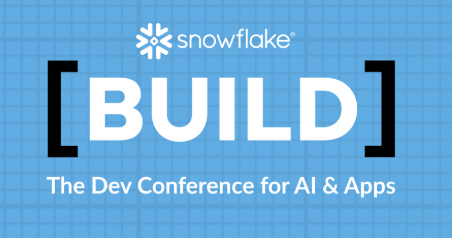

This is an special repository for BUILD London 2025 to make sure this can be run in less than 1h 15m which is the duration of the Bootcamp for Cortex Analyst. 

This is the source code repository for the accompanying [Getting Started with Cortex Analyst](https://quickstarts.snowflake.com/guide/getting_started_with_cortex_analyst/index.html) Quickstart which is available on [quickstarts.snowflake.com](https://quickstarts.snowflake.com). Please refer to the quickstart for step by step explanations but follow this guide here in order to complete the bootcamp for BUILD session.

We are going to use Snowflake Native Git integration in order to accelerate the execution of some tasks (create DB, load data, install apps, etc) that are needed before going deeper into Cortex Analyst. Also this repository simplify some of the requirements of the original repository as for simplicity we are using just the ACCOUNTADMIN role. This is not recommended but we just want to concentrate on the Cortex Analyst piece for this short Bootcamp.

Follow these steps:

## 1.- Create one Snowflake Trial Account

In case you do not have a Snowflake account (we are using ACCOUNTADMIN role for simplicity) you can create one in a few seconds: Go to (https://signup.snowflake.com/), enter your name, work email and click continue:

For this Bootcamp make sure you select these options:
- Snowflake Edition: <b>Enterprise</b>
- Cloud Provider: <b>AWS</b>
- Region: <b>EU (Frankfurt)</b>

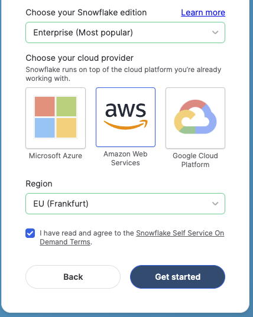

## 2.- Logging into your new account and setup Git

We will use Snowflake Native Git integration to point to this repository. 

First create a new Worksheet to enter a few SQL commands. On the left click on Projects -> Worksheets and on the right lick + for  new SQL worksheet.
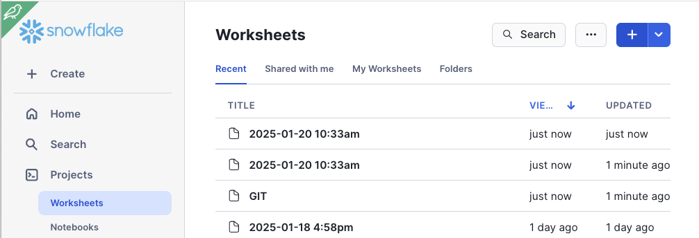

Copy the SQL code form [1_setup_git.sql](https://github.com/ccarrero-sf/build_london_sfguide-getting-started-with-cortex-analyst/blob/main/1_setup_git.sql) and run it in the worksheet. This will:

- Create a database and one schema to hold our Git repository (this one)
- Will enable a bundle to run later a Streamlit in Snowflake App with a required Python version

If you refresh Databases on the left, you will see now your GIT_BUILD_LONDON database with the schema and the Git repository. You can expand it to see the files.
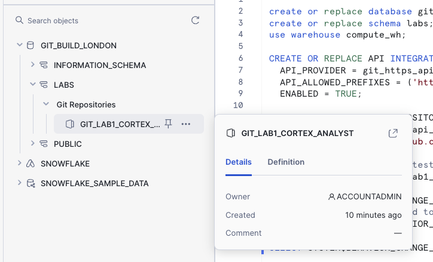

## 3.- Setup the Snowflake Environment

Taking advantage of the Git integration, find <b>create_snowflake_objects.sql</b>, click on "...." and select "Copy into worksheet"
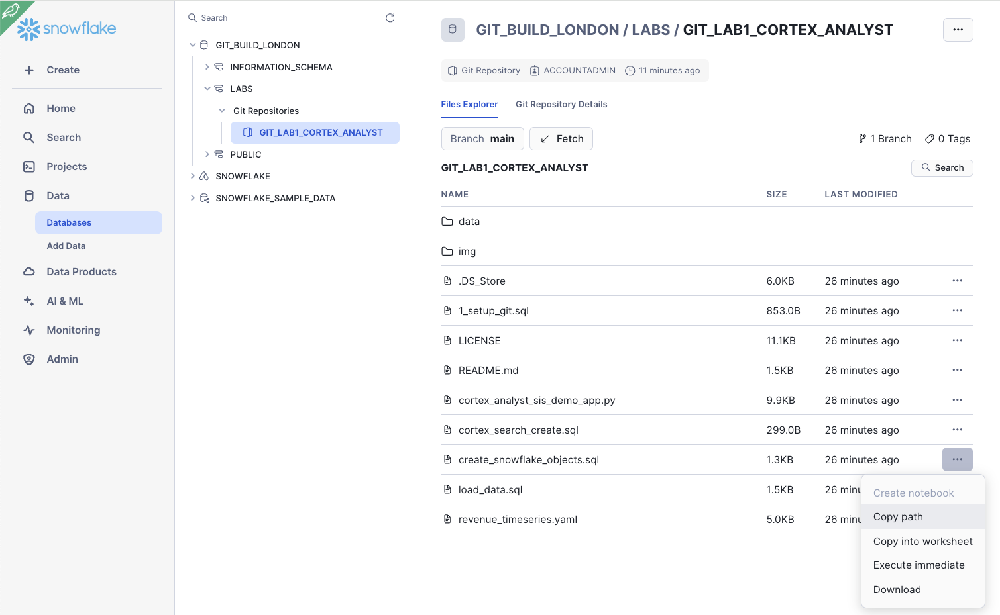

This worksheet is a simplification of the original one from the main Quickstart as we avoid creating a specific ROLE as just use ACCOUNTADMIN for simplicity.

In that worksheet, click on "Run All".

## 4.- Ingest the Revenue Data and Semantic Model YAML

Similar to the previous step, run in a worksheet the SQL file <b>load_data.sql</b>

## 5.- Integrate Cortex Search

And run <b>cortex_search_create.sql</b> as you did before

## 6.- Create Streamlit App

In following steps we will see how to also automaticaly create an Streamlit App. In this step we are going to create it in a manual format so you can also understand this step.

Copy the code from: [cortex_analyst_sis_demo_app.py](https://github.com/ccarrero-sf/build_london_sfguide-getting-started-with-cortex-analyst/blob/main/cortex_analyst_sis_demo_app.py)

Click on Projects -> Streamlit and on the right click on <b>+ Streamlit App</b> button.
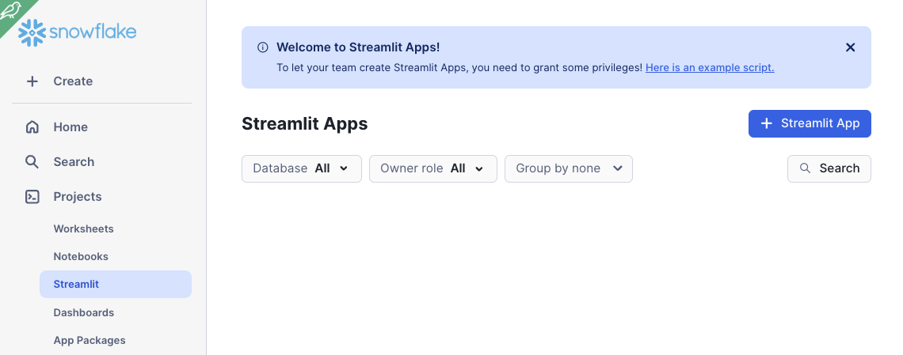

Give the App a name and choose:
- App location: <b>CORTEX_ANALYST_DEMO / REVENUE_TIMESERIES</b>
- App warehouse: <b>CORTEX_ANALYST_WH</b>

Click on Create button:

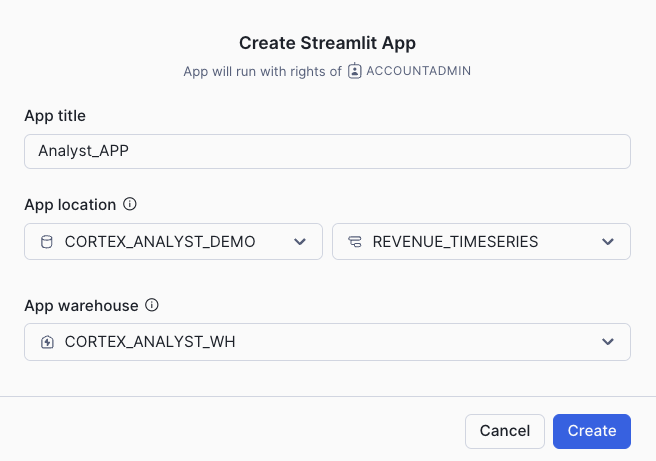

This creates an app from a template. Just remove the default code and paste the code you copied before.

Click on Run to run the App

## 7.- Ask Questions and Review Semantic Model Details

Explore your data with questions and review the [Semantic Model file](https://github.com/ccarrero-sf/build_london_sfguide-getting-started-with-cortex-analyst/blob/main/revenue_timeseries.yaml)

## 8.- Install the Semantic Model Generator

This is the location of the [Semantic Model Generator](https://github.com/Snowflake-Labs/semantic-model-generator) repository. As you can see there are different ways to install it. For this Bootcamp we have already copied the code into the repository to use the Snowflake Native Git integration to install it.

As you have done before, select the SQL script <b>sissetup_snowsightgit.sql</b>, copy into a Worksheet and run it. This will automatically create the Streamlit in Snowflake app to you.

You can go to Projects -> Streamlit and click on <b>Semantic Model Generator</b> app. 

Follow your instructor instructions or explore yourself to:
- Generate a new Semantic Model
- Explore and test an existing one

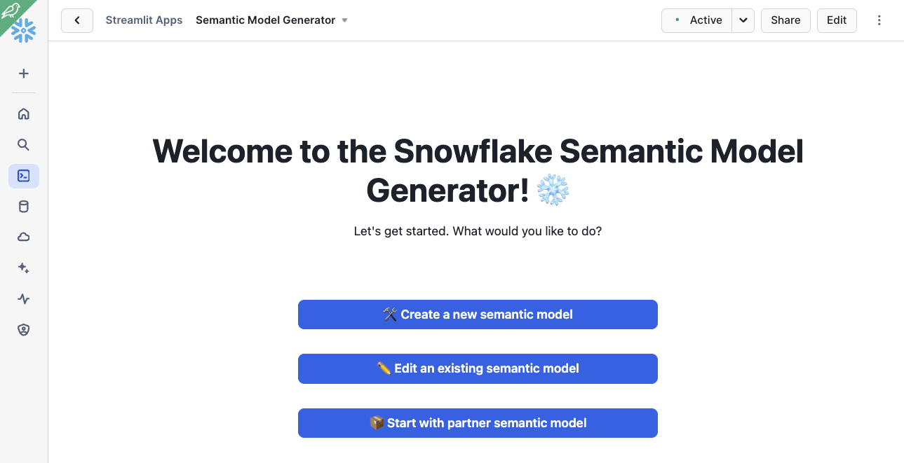

## 9.- Create a New Semantic Model

You can explore how to create a new semantic model for the database that was previously loaded. Click on <b>Create a new semantic model</b>.

Select the database we previously created CORTEX_ANALYST_DEMO, the schema REVENUE_TIME_SERIES and the three tables available.

Click on Submit. After a few minutes it will create a model for you. As you can see, there are soem fields where will be convenient to add some specific information. Let's review the model we already had created.

## 10.- Edit an Existing Semantic Model

Let's open and edit the Semantic Model we had in our repository.

Click on <b>Edit an existing semantic model</b>.

Select te semantic model we already had:

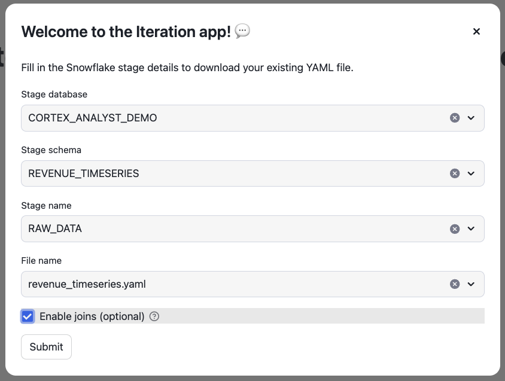

Now try to change or add some business expressions and test them!

We have in our semantic model the definition of <daily_profit> and it is the difference between revenue and expenses. We provide the expression for that. As one example (and this is just imagination!), let's pretend that the business people call it sometimes <b>daily snowfall</b>. 

What happens if we ask the question: "What is the monthly aggregated daily snowfall for last year?"

There is no information about Snowfall in the semantic model so Cortex Analyst cannot figure out the right answer.

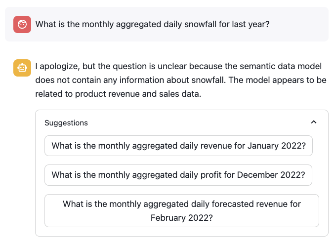

Now let's add the synonyms for daily _profit it into the semantic model:

      - name: daily_profit
        <b>synonyms:
            - daily snowfall</b>
        description: profit is the difference between revenue and expenses.
        expr: revenue - cogs
        data_type: number

Click on Validate button and ask the same question again. Now Cortex Analyst should be able to understand the question:

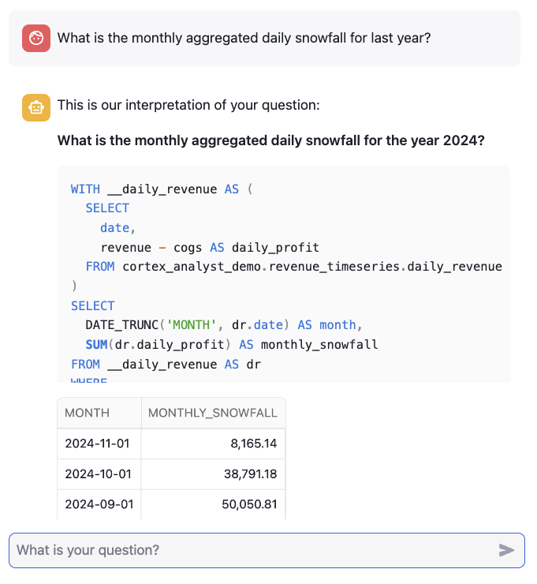

